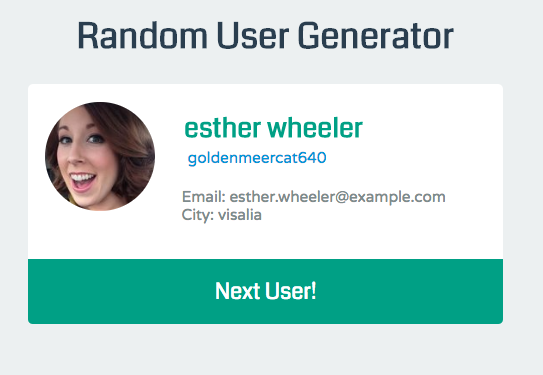
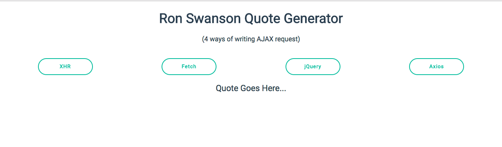

# Modern Web Development Bootcamp - AJAX

This repo is intended to explain all the process to consume an API through HTTP Requests. 

### Good old XMLHttpRequest library

We made a simple app in `src/AJAXAp` and it loads a random dog image using an API through a HTTP Request

``` javascript 
let btn = document.querySelector('#btn');
let img = document.querySelector('#photo');

btn.addEventListener('click', function(){
  console.log('clicked');
  let XHR = new XMLHttpRequest();

  XHR.onreadystatechange = function() {
    if(XHR.readyState === 4 && XHR.status === 200) {
      let url = JSON.parse(XHR.responseText).message;
      img.src = url;
    }
  }

  XHR.open('GET', 'https://dog.ceo/api/breeds/image/random');
  XHR.send();
});
```

### Coding Excercise

Create a small app that gets the current price of Bitcoin. 
The API we used was:
```
https://www.coindesk.com/api/
```

The link to see the JSON we consumed through an HTTP request.
[Current Bitcoin Price JSON](https://api.coindesk.com/v1/bpi/currentprice.json)

The **finished** app can be found in `src/AJAXBitcoin` folder.

## Fetch API

There are many reason for Fetch Library to have substituted XHR for HTTP requests. This [web page](https://domenic.github.io/streams-demo/) exemplifys thes stream concept that Fetch gives and XHR doesn't have.

If you want to read more about Fetch Library go to [MDN documentation](https://developer.mozilla.org/en-US/docs/Web/API/WindowOrWorkerGlobalScope/fetch)

Also the official MDN Fetch API can be found [here](https://developer.mozilla.org/en-US/docs/Web/API/Fetch_API)

***

## Fetch API - Random User Excercise

Make a small app that fetches the info o a user from an open source API called Random User
```
https://randomuser.me/api/

```

The website where to read more information about the API is found [here](https://randomuser.me/)

All the code of the app can be found at `src/FethcRandomUser` folder.

A small glimpse on how the users card could look.



***

## jQuery AJAX Method

A simple example on how `$.ajax` (the 'base' jQuery Method) can be used. This method under the hood just creates an  XMLHttpRequest.

``` javascript

$.ajax({
  mathod: "GET",
  url: "some.api.com",
})
.done(function(res){
  console.log(res);
})
.fail(function(){
  // do something
})

```

You can read the official `$.ajax` documentation [here](http://api.jquery.com/jQuery.ajax/).

This is a live conde [example](https://codepen.io/Colt/pen/brYLvg) on hoy the `$.ajax()` method can be used.

We will use an open API called [Baconipsum](https://baconipsum.com/) to fetch data with JQuery methods. The example consumes this endpoint

```
  https://baconipsum.com/api/?type=meat-and-filler

```

## jQuery Shorthand Methods

There are several methods built on top of the `$.ajax()` method and simplify the request process.

---

> `$.get()`

```javascript
 $.get('https://api.github.com/users/MisaelCalvillo')
  .done(function(data){
    console.log(data);
  })
  .fail(function(){
    console.log("ERROR!");
  })
```
The official documentation on `$.get()` method can be found [here](https://api.jquery.com/jQuery.get/).

---

> `$.post()`

```javascript
    let data = {name: "Charlie", city: "Florence"};
    $.post("www.catsarecoolandsoaredogs.com", data)
      .done(function(data){
      console.log("HI!");
    })
      .fail(function(){
      console.log("ERROR!");
    })
```

The official documentation on `$.post()` method can be found [here](https://api.jquery.com/jQuery.post/).

---

> `$.getJSON()`

```javascript
  $.getJSON("https://api.github.com/users/colt")
  .done(function(data){
    console.log(data);
  })
  .fail(function(){
    console.log("PROBLEM!");
  })
```

The official documentation on `$.getJSON()` method can be found [here](https://api.jquery.com/jQuery.getJSON/)

---

This [pen](https://codepen.io/Colt/pen/braVVr?editors=1010) made by Colt Steele shows a simple use case of these methods. :mag_right:

If you want to check how these methods are built on `$.ajax` you can read the [Shorthand Methods Sourcecode](https://github.com/jquery/jquery/blob/731c501155ef139f53029c0e58409b80f0af3a0c/src/ajax.js "Shorthand Methods Sourcecode").

## jQuery Random Cat Generator - Practice

We used a random cat image generator API
```
https://aws.random.cat/meow
```

We also made use of another jQuery method: `$.attr()` 
This method allow us to change the attributes of DOM elements.

The end result for the exercise can be found in `src/jQueryCatsAPI` folder. 

## Axios

The reason Axios is preferred instead of jQuery is that it is a lightweight library exclusively made for HTTP requests. Also there is a great web site called [You Might Not Need jQuery](http://youmightnotneedjquery.com/ "You Might Not Need jQuery") and there you can learn to do a lot a jQuery stuff without jQuery !!! :rocket:

#### Install Axios

```bash
npm install --save axios
```

or use a CDN

```html
<script src="https://unpkg.com/axios/dist/axios.min.js"></script>
```

#### How to use

The basic syntax to make an HTTP request with `Axios` and you can play with a live code example [here](https://codepen.io/Colt/pen/rzpLqE).

```javascript
axios.get(url)
.then(function(res){
  console.log(res.data);
})
.catch(function(error){
  console.log(error);
})
```
Under the hood `Axios` just creates an XMLHttpRequest.

> You can read the official Axios documentation [here](https://github.com/axios/axios).

#### Challenge - Ron Swanson Random Quote Generator

We created an app that makes the same Http request with the four methods seen here. The end point used for the requests is `https://ron-swanson-quotes.herokuapp.com`. 

The code of the challenge can be found in `src/AJAX4Ways` folder.



